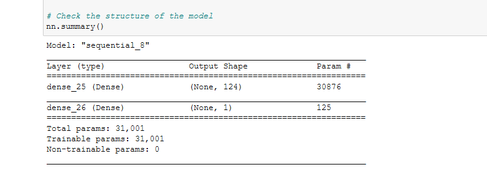
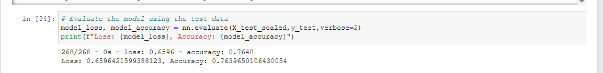

# Neural_Network_Charity_Analysis

<h1>Neural Network Charity Analysis</h1>

<h2>Overview of the Analysis:</h2> 

<h3>Discussion:</h3> 

- A request was made to create a binary classifier for a hypothetical foundation, “Alphabet Soup,” that can predict whether applicants will be successful if funded.
 
- This would help the foundation predict where to make investments.

- A dataset was provided in the form of a CSV file containing more than 34,000 organizations that have received funding from Alphabet Soup over the years arranged into twelve columns as follows:
	
  -	EIN and NAME: Identification columns
  -	APPLICATION_TYPE: Alphabet Soup application type
  -	AFFILIATION: Affiliated sector of industry
  -	CLASSIFICATION: Government organization classification
  -	USE_CASE: Use case for funding
  -	ORGANIZATION: Organization type
  -	STATUS: Active status
  -	INCOME_AMT: Income classification
  -	SPECIAL_CONSIDERATIONS: Special consideration for application
  -	ASK_AMT: Funding amount requested
  -	IS_SUCCESSFUL: Was the money used effectively
-	The goal was to exceed a 75% accuracy level on the test dataset after training. 

<h3>Current Work:</h3> 

- A decision was made to attempt to tackle the problem with machine learning model employing a neural network.

- Then the data was prepped or cleaned as follows:
  -	The EIN column was removed.
  -	Some columns such as APPLICATION_TYPE and CLASSIFICATION were “binned” to reduce the number of features.  (It was eventually discovered that an additional column, NAME, needed to be binned as well.
  -	The number of hidden layers in the neural network models was varied for different training and testing iterations and had the following specifications:
-	The rectified linear activation function (Rectified Linear Unit or ReLU) was used for the hidden layers. 
-	The sigmoid activation function was used for the output layer. 
-	The model was then trained until the accuracy and loss on the training dataset had stabilized. This varied considerably depending on other factors (noted later). 
-	In some modelling/training iterations, dropout layers were interleaved between the hidden layers to determine if they would improve performance.
-	The Name column was binned as noted above, but then re-binned twice more (each time increasing the number of entry rows put into the Other category) to reduce the number of feature inputs to the model. 

<h2>Results:</h2> 

-	**Data Preprocessing**

  -	The IS_SUCCESSFUL variable was considered the “target” for the model.
  
  -	The following columns appeared to be and were treated as “features” for the model:
    -	NAME: Identification column
    -	APPLICATION_TYPE: Alphabet Soup application type
    -	AFFILIATION: Affiliated sector of industry
    -	CLASSIFICATION: Government organization classification
    -	USE_CASE: Use case for funding
    -	ORGANIZATION: Organization type
    -	STATUS: Active status
    -	INCOME_AMT: Income classification
    -	SPECIAL_CONSIDERATIONS: Special consideration for application
    -	ASK_AM: Funding amount requested
    
  -	As noted previously, the EIN variable appeared to be neither a target nor a feature and therefore was removed.
 
-	**Compiling, Training, and Evaluating the Model**

  -	**Activations functions used:**
    -	In all cases, as noted previously, the “relu” activation function was employed for the hidden layers as this was thought to be the best fit for the dataset, and the sigmoid function as used for the output layer since the model was intended to result in a binary classifier. 

- **Number of nodes/neurons:**
    -	In all cases, the number of nodes or neurons in each hidden layer was set to one half of the number of input features. In the cases where dividing by two would result in a fraction (odd number of input features), the number of nodes/neurons was rounded up to the next whole number. This number choice, albeit somewhat arbitrary, was based on an article “Rules-of-thumb for building a Neural Network” (https://towardsdatascience.com/17-rules-of-thumb-for-building-a-neural-network-93356f9930af). One node/neuron was used for the output layer for the same reason the sigmoid activation function used (i.e., the model was a binary classifier).

-	**The number of hidden layers:**
  -	The number of hidden layers was varied between one, two, and three layers. Two and three hidden layers were the options employed in most of the training iterations.
-	**Re-binning:**
  -	As noted previously, the NAME column was binned differently for three iterations, reducing the number of features each time. Each time, the various models noted above were rerun, adjusting the number of nodes/neurons as the number of features decreased.  This did not seem to improve accuracy, but did reduce training time, eventually dropping the requirement from the range of 200 to 500 epochs down to 50 to 100 epochs. 
-	**Dropout (dilution) layers:**
  -	Although not part of the initial proposal, some iterations were performed with dropout layers added between the hidden layers to reduce overfitting. However, their addition showed no significant improvement, and they were removed from subsequent attempts.  (In all cases the test data accuracy was better than the training data accuracy.)  
-	With a few exceptions, all models performed below the performance target of greater than 75% accuracy in the test data. Occasionally, models would achieve just below the target at 75% or 74% accuracy on the test data and vary rarely the 76% would be achieved with a particular model, but the result was not repeatable with subsequent train/test iterations of the same model.  The model and the results shown below represents one of those random occurrences where the target was achieved, in this case, with a single hidden layer and 50 epochs of training. 
-	

-	

-	As indicated above, the steps taken to improve accuracy included varying the number of hidden layers, using different binning parameters to decrease the number of input features, and adding Dropout layers.  The best performance occurred with a single hidden layer and no Dropout layers, although this may not be repeatable. 

<h2>Summary:</h2> 

-	**Accuracy:** An accuracy of 76 % was achieved in a model with one hidden layer and training for 50 epochs. (However, this result may require multiple training iterations to achieve.)

-	**Alternatives:** Models with two or three hidden layers appeared to come close to the goal, achieving 75% and 74% respectively. These would be practical alternatives to a single hidden layer.
